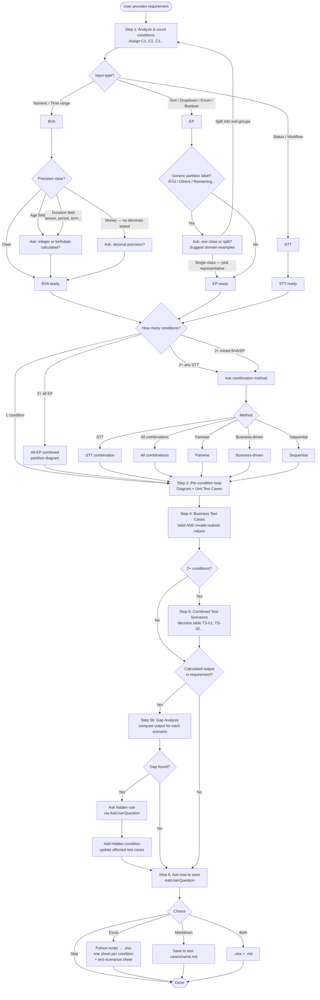

# Test Engineer Skill — Workflow Diagram

```mermaid
flowchart TD
    A([User provides requirement]) --> B[Step 1: Analyze & count conditions\nAssign C1, C2, C3...]

    B --> C{Input type?}
    C -->|Numeric / Time range| D[BVA]
    C -->|Text / Dropdown / Enum / Boolean| E[EP]
    C -->|Status / Workflow| F[STT]

    D --> D1{Precision clear?}
    D1 -->|Age field| D2[Ask: integer or birthdate-calculated?]
    D1 -->|Duration field\ntenure, period, term...| D2
    D1 -->|Money — no decimals stated| D3[Ask: decimal precision?]
    D1 -->|Clear| D4[BVA ready]
    D2 --> D4
    D3 --> D4

    E --> E1{Generic partition label?\nทั่วไป / Others / Remaining...}
    E1 -->|Yes| E2[Ask: one class or split?\nSuggest domain examples]
    E2 -->|Split into sub-groups| B
    E2 -->|Single class — pick representative| E3[EP ready]
    E1 -->|No| E3

    F --> F3[STT ready]

    D4 & E3 & F3 --> G{How many conditions?}

    G -->|1 condition| H
    G -->|2+ all EP| I[All-EP combined\npartition diagram]
    G -->|2+ any STT| J[Ask combination method]
    G -->|2+ mixed BVA/EP| J

    J --> K{Method}
    K -->|STT| L1[STT combination]
    K -->|All combinations| L2[All combinations]
    K -->|Pairwise| L3[Pairwise]
    K -->|Business-driven| L4[Business-driven]
    K -->|Sequential| L5[Sequential]

    I & L1 & L2 & L3 & L4 & L5 --> H

    H[Step 3: Per-condition loop\nDiagram + Unit Test Cases]
    H --> N[Step 4: Business Test Cases\nValid AND invalid realistic values]

    N --> O{2+ conditions?}
    O -->|Yes| P[Step 5: Combined Test Scenarios\ndecision table TS-01, TS-02...]
    O -->|No| Q
    P --> Q

    Q{Calculated output\nin requirement?}
    Q -->|Yes| R[Step 5b: Gap Analysis\ncompute output for each scenario]
    R --> R1{Gap found?}
    R1 -->|Yes| R2[Ask hidden rule\nvia AskUserQuestion]
    R2 --> R3[Add Hidden condition\nupdate affected test cases]
    R3 --> S
    R1 -->|No| S
    Q -->|No| S

    S[Step 6: Ask how to save\nAskUserQuestion]
    S --> T{Choice}
    T -->|Excel| U[Python script → .xlsx\none sheet per condition\n+ test-scenarios sheet]
    T -->|Markdown| V[Save to test-cases/name.md]
    T -->|Both| W[.xlsx + .md]
    T -->|Skip| X
    U & V & W --> X([Done])
```
